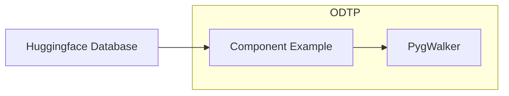

# dt-example

This is an example of a really basic dt execution including dataloading and interactive visualization

## Tutorial

1. Clone this repository
2. Edit `dt-example.sh` with the ODTP user email 
3. Run the bash script: `sh dt-example.sh`
